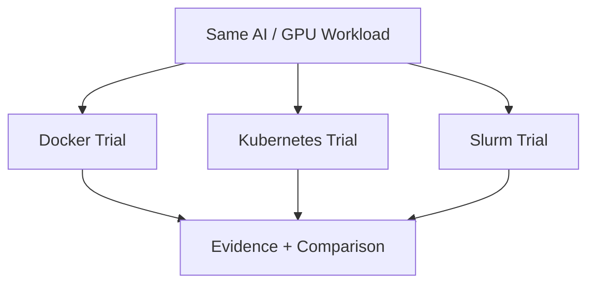

# Scheduler-Colosseum

> **Three schedulers enter the arena. One AI workload exposes what each of them is actually good at.**

## Project status

| Field | Current state |
|---|---|
| **Status** | **Planned — scheduled across the container/Kubernetes/Slurm blocks** |
| **Current stage** | Campaign authored; no tournament round or platform comparison is claimed complete |
| **Lab environment** | Laptop-scale Docker/Kubernetes/Slurm labs; one physical GPU where practical; multi-node/multi-GPU behavior clearly modeled when necessary |
| **Evidence rule** | Comparisons require the same workload and explicit measurement/observation; opinions are not evidence |
| **Last plan sync** | 2026-08-19 |
| **License** | No open-source license is granted unless an explicit license is added later |

## Skills you will build

- Linux process and container fundamentals
- Docker and NVIDIA container runtime concepts
- Kubernetes architecture and scheduling
- Kubernetes GPU device plugins / GPU Operator concepts
- Slurm architecture, partitions, jobs, and GRES
- GPU resource requests and allocation
- Workload placement, isolation, retries, and failure recovery
- Comparing orchestration systems by evidence instead of preference
- Basic benchmarking and repeatable experiment design
- Writing technical recommendations with explicit tradeoffs

## General idea

Scheduler-Colosseum is a **comparative orchestration lab**.

A fictional company is about to buy a small GPU cluster, but three teams are arguing about how workloads should run:

- the application team wants **containers with minimal machinery**,
- the platform team wants **Kubernetes**,
- the research team wants **Slurm**.

Everyone has an opinion. Nobody has run the same workload through all three systems under the same conditions.

You become the **Arena Master**.

Your job is to build controlled trials where the same representative workload is submitted through Docker, Kubernetes, and Slurm, then compare how each system handles scheduling, resource allocation, failure, observability, reproducibility, and operations.

The question is not:

> Which scheduler is best?

It is:

> **Best for what workload, team, and operational problem?**

---

# The arena

The competitors are not treated as interchangeable products.



Where real GPU access is available, the workload can use it. Where the laptop cannot reproduce a multi-GPU cluster, virtual or CPU-only nodes can still demonstrate control-plane behavior, scheduling logic, failure handling, and resource concepts. Limitations must be stated explicitly.

---

## Tournament card

| Round | Challenge | Competitors / concepts | Win condition |
|---|---|---|---|
| 00 | **Know Your Fighter** | process vs container vs orchestrator vs batch scheduler | explain the role of each layer |
| 01 | **Bare Metal Warm-Up** | direct process execution | establish the workload baseline |
| 02 | **Docker Enters** | images, containers, mounts, runtime, GPU exposure | run reproducibly in a container |
| 03 | **The Kubernetes Gate** | control plane, pods, nodes, scheduler | deploy the same workload in K8s |
| 04 | **The GPU Token** | device plugins / GPU Operator concepts | request and expose accelerator resources correctly |
| 05 | **Slurm Takes the Field** | controller, nodes, partitions, jobs | submit the same workload through Slurm |
| 06 | **Resource Hunger Games** | CPU, memory, GPU requests/limits | compare resource allocation behavior |
| 07 | **Kill the Worker** | node/job/pod failure | compare recovery semantics |
| 08 | **The Crowded Arena** | multiple users/jobs, queues, fairness | compare contention behavior |
| 09 | **See the Fight** | logs, status, telemetry | compare operational visibility |
| 10 | **Rematch by Automation** | manifests, job scripts, reproducibility | recreate each trial predictably |
| FINAL | **The Architecture Council** | decision framework | recommend a platform for three different fictional organizations |

---

## The three fighters

### Docker — The Duelist

Fast, direct, and close to the host.

Questions to investigate:

- What does a container actually isolate?
- What still belongs to the host kernel?
- How does a GPU become visible inside a container?
- What operational responsibilities are left to the human?

### Kubernetes — The General

Designed to continually reconcile desired state across a cluster.

Questions to investigate:

- What happens between a manifest and a running pod?
- How are node resources advertised?
- What happens when a node disappears?
- What additional machinery does GPU scheduling require?

### Slurm — The Quartermaster

Designed around allocating scarce compute resources to queued jobs.

Questions to investigate:

- How are nodes and partitions represented?
- How does GRES describe GPUs?
- How are jobs queued and allocated?
- Why is batch scheduling natural for HPC workloads?

---

## Arena rules

Every meaningful comparison should control as many variables as practical.

```text
same workload
same input
same host where possible
same measurement method
same failure injected
same success criteria
```

Then compare dimensions such as:

- setup complexity
- workload submission model
- resource specification
- GPU allocation
- queueing
- multi-user behavior
- failure recovery
- observability
- reproducibility
- operational overhead
- workload fit

Avoid meaningless conclusions like **"Kubernetes is faster"** unless the experiment actually measures something that supports that claim.

---

## Special matches

The fun part begins after all three can run the workload.

Possible bouts:

### The Vanishing Worker
Kill a worker while work is active. Record what each platform believes happened and what recovery looks like.

### The GPU Is Mine
Submit multiple workloads competing for one accelerator. Observe allocation and failure behavior.

### Queue at Dawn
Create more work than the environment can run simultaneously and compare how waiting work is represented.

### Configuration Drift
Change something manually, then determine which platform notices or reconciles it.

### The Noisy Neighbor
Run competing CPU/memory workloads and observe how isolation/resource declarations affect behavior.

---

## Scorecards

Each round should produce a small scorecard, but **not** a fake universal ranking.

Example dimensions:

| Dimension | Docker | Kubernetes | Slurm |
|---|---|---|---|
| Conceptual model | | | |
| Deployment effort | | | |
| Queueing | | | |
| GPU resource model | | | |
| Failure response | | | |
| Multi-user fit | | | |
| Observability | | | |
| Best-fit workload | | | |

Fill these with evidence from completed trials and documentation, not assumptions.

---

## Suggested repository structure

```text
Scheduler-Colosseum/
├── README.md
├── workload/
├── docker/
├── kubernetes/
├── slurm/
├── rounds/
├── scorecards/
├── incidents/
├── diagrams/
└── evidence/
```

---

## Completion standard

Scheduler-Colosseum is complete when you can answer an interview question such as:

> **"Would you run this GPU workload on Kubernetes or Slurm, and why?"**

without reciting generic pros and cons.

You should be able to answer from experiments:

- how the workload was submitted,
- how resources were represented,
- what happened when something failed,
- what was easy or painful to operate,
- and what kind of organization each system best serves.

The champion of the Colosseum is not a technology.

> **The champion is the architecture decision you can defend with evidence.**
